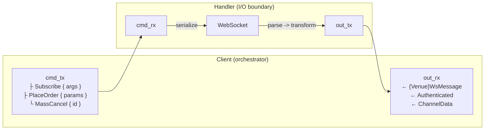

# Adapters

## Introduction

This developer guide provides specifications for building a v2 integration adapter for the
NautilusTrader platform. Adapters connect to trading venues and data providers, translating their
native APIs into the platform's unified interfaces and normalized domain model.

Adapters are Rust-native. They implement the platform data and execution client traits in Rust,
then expose configs, factories, and selected low-level APIs to Python through PyO3.

Use mature adapters according to the boundary you need:

| Adapter | Reference pattern                                                                           |
|---------|---------------------------------------------------------------------------------------------|
| Bybit   | Multi‑product JSON REST/WebSocket adapter with one client type reused per product.          |
| OKX     | Multiple public/private/business WebSocket connections and broad product coverage.          |
| Binance | Product‑specific clients and split market‑data/trading protocols, including SBE.            |
| Kraken  | Spot/Futures submodules with product‑specific HTTP, WebSocket, data, and execution clients. |

No single directory tree fits every venue. Start with the common Rust client and factory contracts,
then split by product or protocol only when the venue has a real boundary.

## Structure of an adapter

NautilusTrader v2 adapters follow a layered architecture with:

- **Rust adapter crate** for networking, parsing, data and execution clients, configs, and factories.
- **PyO3 bindings** for exposing Rust configs, factories, domain types, and selected low-level clients.
- **Generated Python package** for loading the extension module and providing type stubs.

### Rust core (`crates/adapters/your_adapter/`)

The Rust layer handles:

- **HTTP client**: Raw API communication, request signing, rate limiting.
- **WebSocket client**: Low-latency streaming connections, message parsing.
- **Parsing**: Fast conversion of venue data to Nautilus domain models.
- **Python bindings**: PyO3 exports to make Rust functionality available to Python.

Typical Rust structure:

```
crates/adapters/your_adapter/
├── src/
│   ├── common/              # Shared types and utilities
│   │   ├── consts.rs        # Venue constants / broker IDs
│   │   ├── credential.rs    # API key storage and signing helpers
│   │   ├── enums.rs         # Venue enums mirrored in REST/WS payloads
│   │   ├── error.rs         # Adapter-level error aggregation (when applicable)
│   │   ├── models.rs        # Shared model types
│   │   ├── parse.rs         # Shared parsing helpers
│   │   ├── retry.rs         # Retry classification (when applicable)
│   │   ├── urls.rs          # Environment & product aware base-url resolvers
│   │   └── testing.rs       # Fixtures reused across unit tests
│   ├── http/                # HTTP client implementation
│   │   ├── client.rs        # HTTP client with authentication
│   │   ├── error.rs         # HTTP-specific error types
│   │   ├── models.rs        # Structs for REST payloads
│   │   ├── parse.rs         # Response parsing functions
│   │   └── query.rs         # Request and query builders
│   ├── websocket/           # WebSocket implementation
│   │   ├── client.rs        # WebSocket client
│   │   ├── dispatch.rs      # Execution event dispatch and order routing
│   │   ├── enums.rs         # WebSocket-specific enums
│   │   ├── error.rs         # WebSocket-specific error types
│   │   ├── handler.rs       # Feed handler (I/O boundary)
│   │   ├── messages.rs      # Frame and message enums
│   │   ├── parse.rs         # Message parsing functions
│   │   └── subscription.rs  # Subscription topic helpers (optional)
│   ├── python/              # PyO3 Python bindings
│   │   ├── enums.rs         # Python-exposed enums
│   │   ├── http.rs          # Python HTTP client bindings
│   │   ├── urls.rs          # Python URL helpers
│   │   ├── websocket.rs     # Python WebSocket client bindings
│   │   └── mod.rs           # Module exports
│   ├── config.rs            # Configuration structures
│   ├── data.rs              # Data client implementation
│   ├── execution.rs         # Execution client implementation
│   ├── factories.rs         # Factory functions
│   └── lib.rs               # Library entry point
├── tests/                   # Integration tests with mock servers
│   ├── data_client.rs       # Data client integration tests
│   ├── exec_client.rs       # Execution client integration tests
│   ├── http.rs              # HTTP client integration tests
│   └── websocket.rs         # WebSocket client integration tests
└── test_data/               # Canonical venue payloads
```

### Python package (`python/nautilus_trader/adapters/your_adapter`)

The v2 Python package is a thin projection of the Rust module. The runtime `__init__.py` loads
symbols from the extension module, while `__init__.pyi` is generated from
`pyo3_stub_gen` annotations:

```
python/nautilus_trader/adapters/your_adapter/
├── __init__.py   # Extension-module loader
└── __init__.pyi  # Generated type stubs
```

Do not hand-edit generated `.pyi` files. Add PyO3 and stub annotations to the Rust source, then run
`make py-stubs-v2`.

## Adapter implementation sequence

Follow this dependency-driven order when building an adapter. Each phase builds on the previous
one. Complete the Rust client and factory contracts before exposing them through PyO3.

### Phase 1: Rust core infrastructure

Build the low-level networking and parsing foundation.

| Step | Component                  | Description                                                                                  |
|------|----------------------------|----------------------------------------------------------------------------------------------|
| 1.1  | HTTP error types           | Define HTTP‑specific error enum with retryable/non‑retryable variants (`http/error.rs`).     |
| 1.2  | HTTP client                | Implement credentials, request signing, rate limiting, and retry logic.                      |
| 1.3  | HTTP API models            | Define request/response structs for REST endpoints (`http/models.rs`, `http/query.rs`).      |
| 1.4  | HTTP parsing               | Convert venue responses to Nautilus domain models (`http/parse.rs`, `common/parse.rs`).      |
| 1.5  | WebSocket error types      | Define WebSocket‑specific error enum (`websocket/error.rs`).                                 |
| 1.6  | WebSocket client           | Implement connection lifecycle, authentication, heartbeat, and reconnection.                 |
| 1.7  | WebSocket messages         | Define streaming payload types (`websocket/messages.rs`).                                    |
| 1.8  | WebSocket parsing          | Convert stream messages to Nautilus domain models (`websocket/parse.rs`).                    |
| 1.9  | Python bindings            | Expose required Rust types via PyO3 (`python/mod.rs`).                                       |

**Milestone**: Rust crate compiles, unit tests pass, HTTP/WebSocket clients can authenticate and stream/request raw data.

### Phase 2: Instrument definitions

Instruments are the foundation: both data and execution clients depend on them.

| Step | Component                  | Description                                                                                  |
|------|----------------------------|----------------------------------------------------------------------------------------------|
| 2.1  | Instrument parsing         | Parse venue instrument definitions into Nautilus types (spot, perpetual, future, option).    |
| 2.2  | Instrument loading         | Load, filter, cache, and emit instruments through the Rust clients.                          |
| 2.3  | Symbol mapping             | Handle venue‑specific symbol formats and Nautilus `InstrumentId` conversion.                 |

**Milestone**: The data client loads valid instruments, caches them at each parsing boundary, and
serves instrument requests through `DataClient`.

### Phase 3: Market data

Build data subscriptions and historical data requests.

| Step | Component                  | Description                                                                                  |
|------|----------------------------|----------------------------------------------------------------------------------------------|
| 3.1  | Public WebSocket streams   | Subscribe to order books, trades, tickers, and other public channels.                        |
| 3.2  | Historical data requests   | Fetch historical bars, trades, and order book snapshots via HTTP.                            |
| 3.3  | Data client (Rust)         | Implement `DataClient`, emitting `DataEvent` values to the data engine.                      |

**Milestone**: Data client connects, subscribes to instruments, and emits market data to the platform.

### Phase 4: Order execution

Build order management and account state.

| Step | Component                  | Description                                                                                  |
|------|----------------------------|----------------------------------------------------------------------------------------------|
| 4.1  | Private WebSocket streams  | Subscribe to order updates, fills, positions, and account balance changes.                   |
| 4.2  | Basic order submission     | Implement market and limit orders via HTTP or WebSocket.                                     |
| 4.3  | Order modification/cancel  | Implement order amendment and cancellation.                                                  |
| 4.4  | Execution client (Rust)    | Implement `ExecutionClient` using `ExecutionClientCore` and `ExecutionEventEmitter`.         |
| 4.5  | Execution reconciliation   | Generate order, fill, and position status reports for startup reconciliation.                |

**Milestone**: Execution client submits orders, receives fills, and reconciles state on connect.

### Phase 5: Advanced features

Extend coverage based on venue capabilities.

| Step | Component                  | Description                                                                                  |
|------|----------------------------|----------------------------------------------------------------------------------------------|
| 5.1  | Advanced order types       | Conditional orders, stop‑loss, take‑profit, trailing stops, iceberg, etc.                    |
| 5.2  | Batch operations           | Batch order submission, batch cancellation, mass cancel.                                     |
| 5.3  | Venue‑specific features    | Options chains, funding rates, liquidations, or other venue‑specific data.                   |

### Phase 6: Configuration and factories

Wire everything together for production usage.

| Step | Component                  | Description                                                                                  |
|------|----------------------------|----------------------------------------------------------------------------------------------|
| 6.1  | Configuration structs      | Define Rust configs with `bon::Builder`, `Default`, serde, and `ClientConfig`.                |
| 6.2  | Client factories           | Implement `DataClientFactory` and `ExecutionClientFactory`.                                  |
| 6.3  | Python registration        | Register configs and factories with the PyO3 registry and generate stubs.                    |
| 6.4  | Environment variables      | Support credential resolution from environment variables.                                    |

### Phase 7: Testing and documentation

Validate the integration and document usage.

| Step | Component                  | Description                                                                                  |
|------|----------------------------|----------------------------------------------------------------------------------------------|
| 7.1  | Rust unit tests            | Test parsers, signing helpers, and business logic in `#[cfg(test)]` blocks.                  |
| 7.2  | Rust integration tests     | Test HTTP/WebSocket clients against mock Axum servers in `tests/`.                           |
| 7.3  | Python boundary tests      | Test v2 factory/config extraction under `python/tests/unit/adapters/<adapter>/`.             |
| 7.4  | Acceptance tests           | Run every applicable `DataTester` and `ExecTester` spec case.                                |
| 7.5  | Example scripts            | Add Rust node testers and Python v2 `LiveNode` tester scripts.                               |
| 7.6  | Integration guide          | Document capabilities, configuration, venue behavior, and spec exceptions.                   |

See the [Testing](#testing) section for detailed test organization guidelines.

---

## Rust adapter patterns

### Common code (`common/`)

Group venue constants, credential helpers, enums, and reusable parsers under `src/common`.
Adapters such as OKX keep submodules like `consts`, `credential`, `enums`, and `urls` alongside a `testing` module
for fixtures, providing a single place for cross-cutting pieces.
When an adapter has multiple environments or product categories, add a dedicated `common::urls` helper so
REST/WebSocket base URLs stay in sync with the Python layer.

### Symbol normalization (`common/symbol.rs`)

When a venue uses a different symbol format than Nautilus `InstrumentId`, place bidirectional
conversion helpers in `common/symbol.rs`. Two functions form the standard interface:

- `format_instrument_id(venue_symbol, product_type)` converts a venue symbol string to a
  Nautilus `InstrumentId`, appending or transforming product-type suffixes as needed
  (e.g., `"BTCUSDT"` + `Linear` becomes `"BTCUSDT-LINEAR.BYBIT"`).
- `format_venue_symbol(instrument_id)` strips Nautilus suffixes to recover the venue-native
  symbol for API calls.

Common patterns across adapters:

- **Suffix-based product types**: Bybit appends `-SPOT`, `-LINEAR`, `-INVERSE`, `-OPTION`.
  A `BybitSymbol` wrapper validates the suffix and normalizes to uppercase on construction.
- **Implicit product mapping**: Binance USD-M futures append `-PERP` at the Nautilus layer
  while COIN-M keeps the venue's existing `_PERP` suffix.
- **Case normalization**: Convert to uppercase on input when venues are case-insensitive.
- **`Ustr` interning**: Store normalized symbols as `Ustr` for zero-cost comparison.

For venues where the raw symbol maps 1:1 to an `InstrumentId` (no suffix gymnastics), inline
helpers in `common/parse.rs` are sufficient and a dedicated `symbol.rs` is not needed.

### URL resolution

Define URL constants and resolution functions in `common/urls.rs`:

```rust
const VENUE_WS_URL: &str = "wss://stream.venue.com/ws";
const VENUE_TESTNET_WS_URL: &str = "wss://testnet-stream.venue.com/ws";

pub const fn get_ws_base_url(testnet: bool) -> &'static str {
    if testnet { VENUE_TESTNET_WS_URL } else { VENUE_WS_URL }
}
```

Config structs should provide override fields (`base_url_http`, `base_url_ws`, etc.) that fall back
to these defaults when unset.

### Configurations (`config.rs`)

Expose typed config structs in `src/config.rs` so Python callers toggle venue-specific behaviour
(see how OKX wires demo URLs, retries, and channel flags).
Keep defaults minimal and delegate URL selection to helpers in `common::urls`.
For the user-facing design rationale, see the [Configuration](../concepts/configuration.md)
concept guide.

#### Builder and Default

Config structs derive `bon::Builder` and implement `Default`. The builder owns all default
values via `#[builder(default = value)]` annotations. The `Default` impl delegates to the
builder so defaults are defined in exactly one place:

```rust
#[derive(Clone, Debug, bon::Builder)]
pub struct VenueDataClientConfig {
    pub api_key: Option<String>,
    #[builder(default = 60)]
    pub http_timeout_secs: u64,
    #[builder(default = 3)]
    pub max_retries: u32,
}

impl Default for VenueDataClientConfig {
    fn default() -> Self {
        Self::builder().build()
    }
}
```

This prevents drift between builder defaults and `Default` output. Never duplicate
default values in the `Default` impl body.

Bon always defaults `Option<T>` fields to `None`. For the rare case where an
`Option<T>` field should default to `Some(value)`, override it in the `Default` impl
and delegate everything else to the builder:

```rust
impl Default for VenueDataClientConfig {
    fn default() -> Self {
        Self {
            poll_interval_secs: Some(60),
            ..Self::builder().build()
        }
    }
}
```

#### Field type rules

Use plain `T` with `#[builder(default = value)]` when a field always has a sensible
default and downstream code consumes the value directly:

```rust
#[builder(default = 60)]
pub http_timeout_secs: u64,
```

Use `Option<T>` (no builder annotation) when `None` carries distinct meaning such as
"feature disabled", "unbounded", or "inherit from environment":

```rust
/// Interval in seconds between open order checks.
/// When `None`, open order polling is disabled.
pub open_check_interval_secs: Option<f64>,
```

Choose the type based on the config's own semantics, not downstream function
signatures. If `None` means "this feature is off" at the config level, use
`Option<T>`. If the field always resolves to a concrete value, use plain `T`
even when a downstream constructor still accepts `Option<T>` and the call site
wraps with `Some(config.field)`.

#### Python constructors

In `py_new`, accept `Option<T>` for fields that Python callers may omit to select the Rust
default. Keep construction context that must be explicit, such as a trader ID, account ID, or a
venue that requires credentials at construction, as plain `T`. Binance and OKX execution configs
require `TraderId` and `AccountId`; Kraken also requires execution credentials, while Bybit keeps
the account ID in its factory/config boundary.

For optional Python arguments that map to plain Rust fields, unwrap against the default:

```rust
fn py_new(http_timeout_secs: Option<u64>) -> Self {
    let defaults = Self::default();
    Self {
        http_timeout_secs: http_timeout_secs.unwrap_or(defaults.http_timeout_secs),
        ..
    }
}
```

For Rust `Option<T>` fields, use `.or()` to fall back to the default option value.
When the default is `None`, this preserves the caller's `None`. When the default
is `Some(value)`, this fills in the default if the caller passed `None`:

```rust
open_check_interval_secs: open_check_interval_secs.or(defaults.open_check_interval_secs),
```

#### Default values

Use sensible production defaults: credentials as `None` (resolved from environment at
runtime), mainnet URLs, standard timeouts. For `trader_id` and `account_id`, use
placeholder values like `TraderId::from("TRADER-001")` and `AccountId::from("VENUE-001")`.

The `..Default::default()` pattern keeps examples and tests focused on fields that
differ from defaults:

```rust
let config = VenueExecClientConfig {
    trader_id,
    account_id,
    environment: VenueEnvironment::Testnet,
    ..Default::default()
};
```

### Error taxonomy (`common/error.rs`)

For adapters with multiple client types, define an adapter-level error enum in `common/error.rs` that
aggregates component errors:

```rust
#[derive(Debug, thiserror::Error)]
pub enum VenueError {
    #[error("HTTP error: {0}")]
    Http(#[from] VenueHttpError),

    #[error("WebSocket error: {0}")]
    WebSocket(#[from] VenueWsError),

    #[error("Build error: {0}")]
    Build(#[from] VenueBuildError),
}
```

This enables unified error handling at the adapter boundary while preserving component-specific
error details for debugging.

### Retry classification (`common/retry.rs`)

When an adapter needs sophisticated retry logic, define a retry classification module in `common/retry.rs`
that distinguishes between retryable, non-retryable, and fatal errors:

```rust
#[derive(Debug, thiserror::Error)]
pub enum VenueError {
    #[error("Retryable error: {source}")]
    Retryable {
        #[source]
        source: VenueRetryableError,
        retry_after: Option<Duration>,
    },

    #[error("Non-retryable error: {source}")]
    NonRetryable {
        #[source]
        source: VenueNonRetryableError,
    },

    #[error("Fatal error: {source}")]
    Fatal {
        #[source]
        source: VenueFatalError,
    },
}
```

Include helper methods like `from_http_status()`, `from_rate_limit_headers()`, `is_retryable()`,
`is_fatal()`, and `retry_after()` to enable consistent error classification across the adapter.
See the BitMEX adapter for a reference implementation.

### Python exports (`python/mod.rs`)

Mirror the Rust surface area through PyO3 modules by re-exporting clients, enums, and helper functions.
When new functionality lands in Rust, add it to `python/mod.rs` so the Python layer stays in sync
(the OKX adapter is a good reference).

### Python bindings (`python/`)

Expose Rust functionality to Python through PyO3.
Mark venue-specific structs that need Python access with `#[pyclass]` and implement `#[pymethods]` blocks with
`#[getter]` attributes for field access.

For async methods in the HTTP client, use `pyo3_async_runtimes::tokio::future_into_py` to convert Rust futures
into Python awaitables.
When returning lists of custom types, map each item with `Py::new(py, item)` before constructing the Python list.
Register all exported classes and enums in `python/mod.rs` using `m.add_class::<YourType>()` so they're available
to Python code.

Follow the pattern established in other adapters: prefixing Python-facing methods with `py_*` in Rust while using
`#[pyo3(name = "method_name")]` to expose them without the prefix.

When delivering instruments from WebSocket to Python, use `instrument_any_to_pyobject()` which returns PyO3 types
for caching.
For the reverse direction (Python->Rust), use `pyobject_to_instrument_any()` in `cache_instrument()` methods.
Never call `.into_py_any()` directly on `InstrumentAny` as it doesn't implement the required trait.

### Type qualification

Adapter-specific types (enums, structs) and Nautilus domain types should not be fully qualified.
Import them at the module level and use short names (e.g., `OKXContractType` instead of
`crate::common::enums::OKXContractType`, `InstrumentId` instead of `nautilus_model::identifiers::InstrumentId`).
This keeps code concise and readable.
Only fully qualify types from `anyhow` and `tokio` to avoid ambiguity with similarly-named types from other crates.

### String interning

Use `ustr::Ustr` for any non-unique strings the platform stores repeatedly (venues, symbols, instrument IDs) to
minimise allocations and comparisons.

### Shared caches

Choose the collection from the access pattern:

- Use `Arc<AtomicMap<K, V>>` or `Arc<AtomicSet<K>>` for read-heavy snapshots with infrequent
  writes. Reads load one immutable snapshot. Use `rcu()` when writers may race; a `load()` followed
  by `store()` is safe only with one writer.
- Use `Arc<DashMap<K, V>>` or `Arc<DashSet<K>>` when independent keys receive frequent concurrent
  writes or entry-based updates.
- Use a plain `AHashMap` or `AHashSet` for state owned by one handler task.

Bybit, OKX, and Kraken use `AtomicMap` for instrument caches; Binance uses both `AtomicMap` and
`DashMap` according to the product client. Keep shared caches on the outer client so clones observe
the same state.

Where the client exposes cache operations, use `cache_instruments()` for bulk insertion,
`cache_instrument()` for a single upsert, and `get_instrument()` for lookup. Do not add unused
accessors only to complete the set.

### Testing helpers (`common/testing.rs`)

Store shared fixtures and payload loaders in `src/common/testing.rs` for use across HTTP and WebSocket unit tests.
This keeps `#[cfg(test)]` helpers out of production modules and encourages reuse.

### Instrument status diffing (`common/status.rs`)

When a data client polls instrument status via REST, place reusable diff logic in
`common/status.rs` rather than inlining it in the data client. A subscription-aware form used by
Bybit is:

```rust
pub fn diff_and_emit_statuses(
    new_statuses: &AHashMap<InstrumentId, MarketStatusAction>,
    cached_statuses: &mut AHashMap<InstrumentId, MarketStatusAction>,
    subscriptions: Option<&AHashSet<InstrumentId>>,
    sender: &tokio::sync::mpsc::UnboundedSender<DataEvent>,
    ts_event: UnixNanos,
    ts_init: UnixNanos,
)
```

The function compares each entry in `new_statuses` against `cached_statuses`, emitting an
`InstrumentStatus` event for any instrument whose `MarketStatusAction` changed. Instruments
present in the cache but absent from the new snapshot are treated as removed and emit
`NotAvailableForTrading`. The cache always reflects the full API state.

Pass `subscriptions` as `Some(&set)` to restrict emissions to subscribed instruments, or `None`
to emit all changes unconditionally. Store the shared cache in `Arc<AtomicMap<InstrumentId,
MarketStatusAction>>`. For each poll, clone the loaded snapshot, call the diff function, then store
the updated map. Use `rcu()` instead if more than one task can update it.

### Client traits and factories (`data.rs`, `execution.rs`, `factories.rs`)

The Rust client is the platform integration layer:

- Implement `DataClient` for subscriptions and requests. Its synchronous command methods should
  validate or capture inputs, spawn async work when needed, and return without blocking the runtime.
- Implement `ExecutionClient` for order commands, reports, account state, and reconciliation. Build
  it around `ExecutionClientCore` and `ExecutionEventEmitter`.
- Implement `ClientConfig` for each config and downcast it inside `DataClientFactory::create()` or
  `ExecutionClientFactory::create()`.
- Keep factory selection of product-specific clients, `AccountType`, and `OmsType` in one place.

The factory returns `Box<dyn DataClient>` or `Box<dyn ExecutionClient>`. An execution factory
receives a read-only `CacheView`; pass that view to `ExecutionClientCore` rather than mutating the
platform cache from the adapter.

#### Instrument request freshness

`DataClient::request_instrument` and `DataClient::request_instruments` are point-in-time venue
requests. Fetch from the upstream API on every call, even when the requested definitions already
exist in an adapter or platform cache. Update caches from a successful response, but do not use a
cached definition as the response to a new request. If the venue cannot fetch definitions on demand,
return an explicit unsupported error instead of silently serving cached data.

Keep requests separate from subscriptions. Instrument subscriptions deliver future definition
updates; replaying a cached definition does not prove that an adapter supports live instrument
updates. Test request freshness by changing the mock upstream response between two calls and
asserting that the second response reflects the changed source.

The PyO3 module registers factory and config extractors with `get_global_pyo3_registry()` so
`LiveNode.builder().add_data_client(...)` and `.add_exec_client(...)` can pass Python objects into
the Rust factory traits. Register the public config and factory classes in the adapter's
`#[pymodule]` as well.

Complex adapters may also centralize venue-to-domain construction in `factories.rs` when the same
conversion is shared by HTTP, WebSocket, and historical paths. Keep simple conversions in
`common/parse.rs` or the transport-specific `parse.rs` module.

### Connection lifecycle (`connect`)

Both data and execution clients follow a strict initialization order during `connect()` to prevent
race conditions with reconciliation and strategy startup. The platform waits for all clients to
signal connected before running reconciliation or starting strategies, so all initialization must
complete within `connect()`.

#### Data event emission

Data clients emit events to the platform through an unbounded channel obtained at
construction:

```rust
let data_sender = get_data_event_sender();
```

The `DataEvent` enum carries all data types the client produces:

| Variant                       | Usage                                                 |
|-------------------------------|-------------------------------------------------------|
| `DataEvent::Instrument`       | Instrument definitions during bootstrap and updates.  |
| `DataEvent::InstrumentStatus` | Market status changes from polling or WS streams.     |
| `DataEvent::Data`             | Market data (trades, quotes, book deltas, bars).      |
| `DataEvent::Response`         | Responses to historical data requests.                |
| `DataEvent::FundingRate`      | Funding rate updates for derivatives.                 |
| `DataEvent::OptionGreeks`     | Venue‑provided option greeks.                         |

Send events with `self.data_sender.send(DataEvent::Instrument(instrument))`. Log warnings
on send failure but do not propagate the error since a closed receiver means the system
is shutting down. Clone the sender for spawned tasks that emit data from async work.

#### Data client

1. **Fetch instruments via REST** - call `bootstrap_instruments()` or equivalent.
2. **Cache locally** - populate the client's internal instrument map and HTTP client cache.
3. **Emit to data engine** - send each instrument as `DataEvent::Instrument` via `data_sender`.
   These events are queued during startup and processed before reconciliation runs.
4. **Cache to WebSocket** - call `ws.cache_instruments()` so the handler can parse messages.
5. **Connect WebSocket** - establish the streaming connection.

```rust
async fn connect(&mut self) -> anyhow::Result<()> {
    let instruments = self.bootstrap_instruments().await?;
    ws.cache_instruments(instruments);
    ws.connect().await?;
    ws.wait_until_active(10.0).await?;
    // ...
}
```

#### Order book event flags

When a parser emits `OrderBookDelta` values, set the flags that define each logical event boundary.
See [Delta flags and event boundaries](../concepts/data/index.md#delta-flags-and-event-boundaries).

- Set `F_LAST` on the last delta in every logical event group. The data engine uses it to flush
  buffered deltas to subscribers.
- Set `F_SNAPSHOT` on every delta in a snapshot sequence, including the `Clear` action.
- Set both `F_SNAPSHOT` and `F_LAST` on the `Clear` delta for an empty snapshot.
- When one venue message contains multiple logical update groups, terminate each group with
  `F_LAST`.

A missing `F_LAST` does not raise an error, but buffered subscribers never receive the event.

#### Execution client

1. **Initialize instruments** - call `ensure_instruments_initialized_async()` which checks
   `self.core.instruments_initialized()` and returns early if instruments are already cached.
   Otherwise it fetches instruments via REST and caches them to the HTTP client, WebSocket
   client, and any broadcaster clients.
2. **Connect WebSocket** - establish the private streaming connection.
3. **Subscribe to channels** - orders, executions, positions, wallet/margin.
4. **Start WebSocket stream handler** - begin processing incoming messages.
5. **Fetch account state** - call `refresh_account_state()` which requests balances and
   margins via REST, builds an `AccountState`, and emits it through the
   `ExecutionEventEmitter`.
6. **Await account registered** - call `await_account_registered(timeout_secs)` which polls
   `self.core.cache().account(&account_id)` at 10ms intervals until the account appears or
   the timeout expires. This step blocks connect so the portfolio can process orders during
   reconciliation.
7. **Signal connected** - call `self.core.set_connected()`.

```rust
async fn connect(&mut self) -> anyhow::Result<()> {
    self.ensure_instruments_initialized_async().await?;

    self.ws_client.connect().await?;
    self.ws_client.wait_until_active(10.0).await?;
    // ... subscribe channels, start stream ...

    self.refresh_account_state().await?;
    self.await_account_registered(30.0).await?;

    self.core.set_connected();
    Ok(())
}
```

#### Account state emission

The `ExecutionEventEmitter` provides two methods for emitting account state:

- `emit_account_state(balances, margins, reported, ts_event)` builds an `AccountState`
  from raw parameters using the internal `OrderEventFactory`, then dispatches it. Use
  this when the adapter has individual balance and margin values to combine.
- `send_account_state(state)` dispatches a pre-built `AccountState`. Use this when the
  adapter already has a fully constructed state from parsing an HTTP or WebSocket payload.

## HTTP client patterns

Adapters use a two-layer HTTP client architecture: a raw client for low-level API operations and a domain
client for high-level logic. The split also enables efficient cloning for Python bindings.

### Client structure

The architecture consists of two complementary clients:

1. **Raw client** (`MyRawHttpClient`) - Low-level API methods matching venue endpoints.
2. **Domain client** (`MyHttpClient`) - High-level methods using Nautilus domain types.

```rust
use std::sync::Arc;

use nautilus_core::AtomicMap;
use nautilus_network::http::HttpClient;
use ustr::Ustr;

// Raw HTTP client - low-level API methods matching venue endpoints
pub struct MyRawHttpClient {
    base_url: String,
    client: HttpClient,  // Use nautilus_network::http::HttpClient, not reqwest directly
    credential: Option<Credential>,
    retry_manager: RetryManager<MyHttpError>,
    cancellation_token: CancellationToken,
}

// Domain HTTP client - wraps raw client with Arc, provides high-level API
pub struct MyHttpClient {
    pub(crate) inner: Arc<MyRawHttpClient>,
    // Additional domain-specific state (e.g., instrument cache)
    instruments: Arc<AtomicMap<Ustr, InstrumentAny>>,
}
```

**Key points**:

- **Raw client** (`MyRawHttpClient`) contains low-level HTTP methods named to match venue endpoints
  (e.g., `get_instruments`, `get_balance`, `place_order`). These methods take venue-specific query
  objects and return venue-specific response types.
- **Domain client** (`MyHttpClient`) wraps the raw client in an `Arc` for efficient cloning (required
  for Python bindings). It provides high-level methods that accept Nautilus domain types
  (e.g., `InstrumentId`, `ClientOrderId`) and return domain objects. It may also cache instruments
  or other venue metadata.
- Use `nautilus_network::http::HttpClient` instead of `reqwest::Client` directly for rate limiting,
  retry logic, and consistent error handling.
- Expose only the clients Python users need. The domain client is normally the primary interface;
  a raw client is useful only when the low-level venue API is intentionally public.

### Parser functions

Parser functions convert venue-specific data structures into Nautilus domain objects. Place them in
`common/parse.rs` for cross-cutting conversions (instruments, trades, bars) or `http/parse.rs` for
REST-specific transformations. Each parser takes venue data plus context (account IDs, timestamps,
instrument references) and returns a Nautilus domain type wrapped in `Result`.

**Standard patterns:**

- Parse prices, quantities, money, fees, and other discrete domain values as `Decimal`, then build
  domain types at the instrument's precision. Use `f64` only for inherently continuous values.
- Check for empty strings before parsing optional fields - venues often return `""` instead of omitting fields.
- Map venue enums to Nautilus enums explicitly with `match` statements rather than implementing automatic conversions that could hide mapping errors.
- Accept instrument references when precision or other metadata is required for constructing Nautilus types (quantities, prices).
- Use descriptive function names: `parse_position_status_report`, `parse_order_status_report`, `parse_trade_tick`.

Place parsing helpers (`parse_price_with_precision`, `parse_timestamp`) in the same module as private functions when they're reused across multiple parsers.

### Timestamp conventions

Nautilus uses `UnixNanos` (nanoseconds since epoch). Most venues deliver `ms`. Convert at the
parser boundary using `nautilus_core::datetime::millis_to_nanos`; document the wire unit on the
struct field. `ts_event` is the converted venue timestamp; `ts_init` is `clock.get_time_ns()`.
For records with no venue timestamp (instruments), use `clock.get_time_ns()` for both.

### Method naming and organization

The raw client mirrors venue endpoints with venue-specific parameter and response types. The domain
client wraps it and exposes high-level methods that accept Nautilus domain types.

**Naming conventions:**

- **Raw client methods**: Named to match venue endpoints as closely as possible (e.g., `get_instruments`, `get_balance`, `place_order`). These methods are internal to the raw client and take venue-specific types (builders, JSON values).
- **Domain client methods**: Named based on operation semantics (e.g., `request_instruments`, `submit_order`, `cancel_order`). These are the methods exposed to Python and take Nautilus domain objects (InstrumentId, ClientOrderId, OrderSide, etc.).

**Domain method flow:**

Domain methods follow a three-step pattern: build venue-specific parameters from Nautilus types, call the corresponding raw client method, then parse the response. For endpoints returning domain objects (positions, orders, trades), call parser functions from `common/parse`. For endpoints returning raw venue data (fee rates, balances), extract the result directly from the response envelope. Methods prefixed with `request_*` indicate they return domain data, while methods like `submit_*`, `cancel_*`, or `modify_*` perform actions and return acknowledgments.

The domain client wraps the raw client in an `Arc` for efficient cloning required by Python bindings.

### Query parameter builders

Use the `derive_builder` crate with proper defaults and ergonomic Option handling:

```rust
use derive_builder::Builder;

#[derive(Clone, Debug, Deserialize, Serialize, Builder)]
#[serde(rename_all = "camelCase")]
#[builder(setter(into, strip_option), default)]
pub struct InstrumentsInfoParams {
    pub category: ProductType,
    #[serde(skip_serializing_if = "Option::is_none")]
    pub symbol: Option<String>,
    #[serde(skip_serializing_if = "Option::is_none")]
    pub limit: Option<u32>,
}

impl Default for InstrumentsInfoParams {
    fn default() -> Self {
        Self {
            category: ProductType::Linear,
            symbol: None,
            limit: None,
        }
    }
}
```

**Key attributes:**

- `#[builder(setter(into, strip_option), default)]` - enables clean API: `.symbol("BTCUSDT")` instead of `.symbol(Some("BTCUSDT".to_string()))`.
- `#[serde(skip_serializing_if = "Option::is_none")]` - omits optional fields from query strings.
- Implement `Default` only when a fully defaulted request is valid. Keep required venue parameters
  required in the builder.

### Request signing and authentication

Keep signing logic in a `Credential` struct under `common/credential.rs`:

- Store API keys in an owned string form and keep secrets in a type that zeroizes on drop. Redact
  secrets, passphrases, and private keys from `Debug` output.
- Implement the venue's signing scheme over the exact bytes sent on the wire. This may be HMAC,
  Ed25519, or another venue-specific scheme.
- Pass the credential to the raw HTTP client; the domain client delegates signing through the inner client.

Reuse credential storage across HTTP and WebSocket when the venue uses the same key material, but
keep protocol-specific signing methods when their payload formats differ.

### Credential module structure

Centralize credential environment names, resolution, validation, storage, and signing in
`common/credential.rs`. Config structs are DTOs and must not resolve environment variables.

For a venue with one key pair per environment, use `credential_env_vars()` and
`Credential::resolve()` with `resolve_env_var_pair`. If product type, key type, or deprecation
handling changes the lookup, expose a purpose-specific resolver such as `resolve_credentials(...)`
instead. Binance is the reference for product-specific Ed25519 resolution; Bybit, OKX, and Kraken
show the simpler environment mapping patterns.

**Simple layout:**

```rust
use nautilus_core::env::resolve_env_var_pair;

/// Returns the environment variable names for API credentials.
pub fn credential_env_vars(is_testnet: bool) -> (&'static str, &'static str) {
    if is_testnet {
        ("{VENUE}_TESTNET_API_KEY", "{VENUE}_TESTNET_API_SECRET")
    } else {
        ("{VENUE}_API_KEY", "{VENUE}_API_SECRET")
    }
}

impl Credential {
    /// Resolves credentials from provided values or environment variables.
    pub fn resolve(
        api_key: Option<String>,
        api_secret: Option<String>,
        is_testnet: bool,
    ) -> Option<Self> {
        let (key_var, secret_var) = credential_env_vars(is_testnet);
        let (k, s) = resolve_env_var_pair(api_key, api_secret, key_var, secret_var)?;
        Some(Self::new(k, s))
    }
}
```

### Environment variable conventions

Adapters load API credentials from environment variables when not provided directly, avoiding
hardcoded secrets.

**Naming conventions:**

| Environment  | API Key Variable          | API Secret Variable          |
|--------------|---------------------------|------------------------------|
| Mainnet/Live | `{VENUE}_API_KEY`         | `{VENUE}_API_SECRET`         |
| Testnet      | `{VENUE}_TESTNET_API_KEY` | `{VENUE}_TESTNET_API_SECRET` |
| Demo         | `{VENUE}_DEMO_API_KEY`    | `{VENUE}_DEMO_API_SECRET`    |

Some venues require additional credentials:

- OKX: `OKX_API_PASSPHRASE`

**Key principles:**

- Centralize environment variable names and lookup rules in `common/credential.rs`; do not
  duplicate them as string literals across clients.
- Environment variable resolution should happen in core Rust code, not Python bindings.
- Use `get_or_env_var_opt` for optional credentials (returns `None` if missing).
- Use `get_or_env_var` when credentials are required (returns error if missing).
- Invalid credentials (e.g. malformed keys) must fail fast with an error, never silently
  degrade to unauthenticated mode.

### Error handling and retry logic

Use the `RetryManager` from `nautilus_network` for consistent retry behavior.

### Rate limiting

Configure rate limiting through `HttpClient` using `LazyLock<Quota>` static variables.

**Naming conventions:**

- REST quotas: `{VENUE}_REST_QUOTA` (e.g., `OKX_REST_QUOTA`, `BYBIT_REST_QUOTA`)
- WebSocket quotas: `{VENUE}_WS_{OPERATION}_QUOTA` (e.g., `OKX_WS_CONNECTION_QUOTA`, `OKX_WS_ORDER_QUOTA`)
- Rate limit keys: `{VENUE}_RATE_LIMIT_KEY_{OPERATION}` (e.g., `OKX_RATE_LIMIT_KEY_SUBSCRIPTION`, `OKX_RATE_LIMIT_KEY_ORDER`)

**Standard rate limit keys for WebSocket:**

| Key                             | Operations                       |
|---------------------------------|----------------------------------|
| `*_RATE_LIMIT_KEY_SUBSCRIPTION` | Subscribe, unsubscribe, login.   |
| `*_RATE_LIMIT_KEY_ORDER`        | Place orders (regular and algo). |
| `*_RATE_LIMIT_KEY_CANCEL`       | Cancel orders, mass cancel.      |
| `*_RATE_LIMIT_KEY_AMEND`        | Amend/modify orders.             |

**Example:**

```rust
pub static OKX_REST_QUOTA: LazyLock<Quota> =
    LazyLock::new(|| Quota::per_second(NonZeroU32::new(250).unwrap()));

pub static OKX_WS_SUBSCRIPTION_QUOTA: LazyLock<Quota> =
    LazyLock::new(|| Quota::per_hour(NonZeroU32::new(480).unwrap()));

pub const OKX_RATE_LIMIT_KEY_ORDER: &str = "order";
```

Pass rate limit keys when sending WebSocket messages to enforce per-operation quotas:

```rust
self.send_with_retry(payload, Some(vec![OKX_RATE_LIMIT_KEY_ORDER.to_string()])).await
```

**Policy:**

Adapters should converge on the following rate-limiting principles.

- Map each quota to the scope the venue meters it against (per IP, account, API key, connection,
  URL, transport, or operation class). Draw every client that shares a scope (data, execution,
  pollers) from one limiter keyed by that scope; separate limiters for a shared cap silently double
  the effective rate. Add distinct keys only for sub-caps the venue meters independently.
- Bucket data and execution traffic apart only when the venue meters them apart. The split still
  matters for recovery: a data-path trip (subscribe, unsubscribe, control frames) rejects a
  subscription, surfaces as missing market data, and recovers through adapter retry or reconnect,
  usually without the strategy knowing; an execution-path trip is strategy-visible and governed by
  the outcome policy below.
- Pace to the venue's actual metering, not just its headline number. Match the window shape, burst,
  and any endpoint weights: a token bucket at the documented rate can still overrun a strict rolling
  window after an idle burst. Wire latency does not create rate headroom, since a constant delay
  shifts arrival times without changing the rate and jitter bunches messages as readily as it
  spreads them. Add headroom only when window semantics or shared external traffic require it, never
  as a round-number buffer.
- Bound inflight with a closed-loop gate, not the limiter. When a venue caps concurrent
  unacknowledged messages separately from the send rate, gate dispatch on a count that releases a
  slot on every terminal outcome: acknowledgement, rejection, send failure, and reconnect. A
  send-rate limiter cannot do this, because inflight tracks send rate times acknowledgement latency,
  which it never observes.
- Treat an execution-path rate-limit response as an unknown outcome, not a rejection. Per the
  [order command outcome policy](#order-command-outcome-policy), a rate-limited command may still
  have reached the venue, so retry only when the command is idempotent or the venue proves it was
  not processed; otherwise leave the order in flight and reconcile.

## WebSocket client patterns

WebSocket clients handle real-time streaming data. They manage connection state, authentication,
subscriptions, and reconnection logic.

### Client structure

WebSocket adapters use a **two-layer architecture** to separate Python-accessible state from high-performance async I/O:

#### Connection state tracking

Track connection state using `Arc<ArcSwap<AtomicU8>>` to provide lock-free, race-free visibility across all clones:

```rust
use arc_swap::ArcSwap;

pub struct MyWebSocketClient {
    connection_mode: Arc<ArcSwap<AtomicU8>>,  // Shared connection mode (lock-free)
    signal: Arc<AtomicBool>,                   // Cancellation signal for graceful shutdown
    // ...
}
```

**Pattern breakdown:**

- **Outer `Arc`**: Shared across all clones (Python bindings clone clients before async operations).
- **`ArcSwap`**: Enables atomic pointer replacement via `.store()` without replacing the outer Arc.
- **Inner `Arc<AtomicU8>`**: The actual connection state from `WebSocketClient::connection_mode_atomic()`.

Initialize with a placeholder atomic (`ConnectionMode::Closed`), then in `connect()` call
`.store(client.connection_mode_atomic())` to atomically swap to the real client's state.
All clones see updates instantly through lock-free `.load()` calls in `is_active()`.

The underlying `WebSocketClient` sends a `RECONNECTED` sentinel message when reconnection completes, triggering resubscription logic in the handler.

**Outer client** (`{Venue}WebSocketClient`):

- Orchestrates connection lifecycle, authentication, subscriptions.
- Maintains state visible to Python using collections chosen by access pattern.
- Tracks subscription state for reconnection logic.
- Stores instrument metadata needed to parse messages after reconnect.
- Sends commands to handler via `cmd_tx` channel.
- Receives venue events via `out_rx` channel.

**Inner handler** (`{Venue}WsFeedHandler`):

- Runs in dedicated Tokio task as stateless I/O boundary.
- Owns `WebSocketClient` exclusively (no `RwLock` needed).
- Processes commands from `cmd_rx` -> serializes to JSON -> sends via WebSocket.
- Receives raw WebSocket messages -> deserializes into `{Venue}WsFrame` -> converts to `{Venue}WsMessage` -> emits via `out_tx`.
- Owns pending request state using `AHashMap<K, V>` (single-threaded, no locking).
- Uses `VecDeque<{Venue}WsMessage>` to buffer multi-message yields from a single frame parse.

Some venues expose separate WebSocket endpoints for market data and order management
(different URLs, authentication flows, or message protocols). In this case, split into
two client+handler pairs under `websocket/data/` and `websocket/orders/` subdirectories,
each following the same two-layer pattern. Name them `{Venue}MdWebSocketClient` /
`{Venue}MdWsFeedHandler` and `{Venue}OrdersWebSocketClient` / `{Venue}OrdersWsFeedHandler`.

**Communication pattern:**



**Key principles:**

- **No shared locks on hot path**: Handler owns `WebSocketClient`, client sends commands via lock-free mpsc channel.
- **Command pattern for all sends**: Subscriptions, orders, cancellations all route through `HandlerCommand` enum.
- **Event pattern for state**: Handler emits `{Venue}WsMessage` events (including `Authenticated`), client maintains state from events.
- **Pending state ownership**: Handler owns `AHashMap` for matching responses (no `Arc<DashMap>` between layers).
- **Message buffering**: Handler uses `VecDeque<{Venue}WsMessage>` for frames that produce multiple output messages. The `next()` method drains the queue before polling channels.
- **Shared client state**: Use `AtomicMap` for read-heavy snapshots such as instrument caches. Use
  `DashMap` for independently updated entries such as pending requests or subscriptions. The
  handler uses `AHashMap` for state owned by its task.

#### Handler initialization handshake (`SetClient`)

The handler does not own its `WebSocketClient` at construction time.
`WebSocketClient` is not `Clone` and is awkward to move into an already-spawned
task constructor; several adapters use a deferred handoff through the command
channel. Lighter uses this stricter ordering:

1. The outer client calls `WebSocketClient::connect(...)` and obtains the
   live client.
2. The outer client creates the local `cmd_tx`/`cmd_rx` and `out_tx`/`out_rx`
   channels. The connection-mode atomic is captured into a local before
   `client` is moved.
3. The outer client sends `HandlerCommand::SetClient(client)` on the local
   `cmd_tx` first, followed by any cache-replay commands
   (e.g. `InitializeInstruments`).
4. Only after `SetClient` is queued does the outer client publish the new
   command channel (swap `self.cmd_tx`) and store the captured connection
   mode (transition `is_active()` to true). Doing this in the opposite
   order races: a clone observing `is_active()` could enqueue a Subscribe
   on the published `cmd_tx` before SetClient lands, and the handler would
   drop it because `inner == None`.
5. The outer client spawns the handler task with `cmd_rx`. The handler
   constructor takes `inner: Option<WebSocketClient>` initialized to
   `None`; the first command it processes is `SetClient`, which moves the
   client into `self.inner`.
6. Any subscribe/order commands queued by clones after step 4 land behind
   `SetClient` and `InitializeInstruments` in `cmd_rx`, so they reach a
   fully wired handler in queue order.

```rust
pub enum HandlerCommand {
    SetClient(WebSocketClient),
    Disconnect,
    Subscribe { /* ... */ },
    // ... other commands
}

pub(super) struct {Venue}WsFeedHandler {
    inner: Option<WebSocketClient>,  // None until SetClient
    cmd_rx: tokio::sync::mpsc::UnboundedReceiver<HandlerCommand>,
    // ...
}

// In the cmd_rx match arm:
HandlerCommand::SetClient(client) => {
    self.inner = Some(client);
}
```

BitMEX, OKX, Bybit, Hyperliquid, and Lighter all use `SetClient` to hand the
connected `WebSocketClient` to the handler. Lighter queues `SetClient` before it
publishes the new `cmd_tx` or marks the connection active; older adapters may
publish the command channel first.

### Authentication

Authentication state is managed through events:

- Handler processes `Login` response -> **returns** `{Venue}WsMessage::Authenticated` immediately.
- Client receives event -> updates local auth state -> proceeds with subscriptions.
- `AuthTracker` (from `nautilus_network::websocket::auth`) tracks auth state across threads.

The `AuthTracker` struct from `nautilus_network` provides thread-safe authentication state:

```rust
pub struct AuthTracker {
    tx: Arc<Mutex<Option<AuthResultSender>>>,
    authenticated: Arc<AtomicBool>,
}
```

`AuthTracker` is internally `Arc`-based, so cloning shares state. Both client and handler
store `auth_tracker: AuthTracker` and receive a `.clone()` of the same instance. The tracker
exposes a four-method lifecycle: `begin()` starts an attempt and returns a one-shot receiver,
`succeed()` sets the authenticated flag and notifies the receiver, `fail(message)` clears
the flag with an error, and `invalidate()` clears the flag on disconnect. Downstream
consumers query `is_authenticated()` for lock-free reads via the internal `AtomicBool`.

**Note**: The `Authenticated` message is consumed in the client's spawn loop for reconnection
flow coordination and is not forwarded to downstream consumers (data/execution clients).
Downstream consumers can query authentication state via `AuthTracker` if needed. The execution
client's `Authenticated` handler only logs at debug level with no important logic depending
on this event.

#### Auth-token rotation (single-endpoint mixed-trust adapters)

Some venues run public market data and authenticated account channels through a
single WebSocket endpoint, gated by a short-lived bearer token attached to each
subscribe request. Lighter is the canonical example: the token is a Schnorr
signature over `(deadline, account_index, api_key_index)` with a venue-imposed
hard cap of 8 hours (`LIGHTER_AUTH_TOKEN_MAX_TTL`). `build_auth_token_for(...)`
currently emits a 7-hour token, and the execution client refreshes account
channel subscriptions every 6 hours.

This contrasts with the per-message-signature pattern (Hyperliquid) and the
session-login pattern (BitMEX, Bybit); neither needs in-session token rotation.

**Token lifecycle**

The outer client owns the schedule; the handler owns the wire send. The
flow is:

1. **Mint before account subscribes**: The execution client calls
   `build_auth_token_for(...)` after the WebSocket reaches active state, then
   uses that token for the initial account-channel subscriptions.
2. **Distribute on subscribe**: `subscribe_account(...)` attaches the token to
   `HandlerCommand::Subscribe`. The WebSocket client stores the exact
   `(channel, auth)` pair in `subscription_args` for reconnect replay.
3. **Schedule refresh**: After the execution WebSocket consumer starts, the
   execution client spawns a refresh task on `get_runtime()`. The task waits for
   `AUTH_TOKEN_REFRESH_INTERVAL` (6 hours) or a reconnect notification, mints a
   new token, and re-issues `subscribe_account(...)` for every account channel.
4. **Stop on disconnect**: The refresh task observes the execution client's
   cancellation token and exits when the client stops or disconnects.

**Where the schedule lives**

Place the rotation timer in the outer client, not the handler. The execution
client owns the credential and decides when to mint; the handler remains an I/O
boundary that sends the supplied token and signs nothing on its own.

```rust
fn spawn_auth_token_refresh(&self, credential: Credential) {
    let ws_client = self.ws_client.clone();
    let cancellation_token = self.cancellation_token.clone();
    let account_index = credential.account_index();
    let refresh_notify = Arc::clone(&self.auth_refresh_notify);
    let channels = [
        LighterWsChannel::AccountAllOrders(account_index),
        LighterWsChannel::AccountAllTrades(account_index),
        LighterWsChannel::AccountAllPositions(account_index),
        LighterWsChannel::AccountAllAssets(account_index),
    ];

    get_runtime().spawn(async move {
        loop {
            tokio::select! {
                () = cancellation_token.cancelled() => break,
                () = refresh_notify.notified() => {},
                () = tokio::time::sleep(AUTH_TOKEN_REFRESH_INTERVAL) => {},
            }

            if let Ok(token) = build_auth_token_for(&credential) {
                for channel in channels.clone() {
                    let _ = ws_client
                        .subscribe_account(channel, token.clone())
                        .await;
                }
            }
        }
    });
}
```

**Reconnect interaction**

On `Reconnected`, the Lighter WebSocket client replays the tracked
`subscription_args` through `HandlerCommand::Subscribe`, then forwards the reconnect event.
The execution client notifies the refresh task, which immediately mints a fresh token and
re-subscribes every account channel. The fresh subscriptions replace the stored replay tokens.

**Failure handling**

Subscription send failures call `mark_failure(topic)` so reconnect replay keeps
the topic pending. Lighter does not currently implement an immediate auth-token
refresh path on a mid-session venue rejection.

### Subscription management

#### Shared `SubscriptionState` pattern

The `SubscriptionState` struct from `nautilus_network::websocket` is shared between client and handler using `Arc<DashMap<>>` internally for thread-safe access:

- **`SubscriptionState` is shared via `Arc`**: Both client and handler receive `.clone()` of the same instance (shallow clone of Arc pointers).
- **Responsibility split**: Client tracks user intent (`mark_subscribe`, `mark_unsubscribe`), handler tracks server confirmations (`confirm_subscribe`, `confirm_unsubscribe`, `mark_failure`).
- **Why both need it**: Single source of truth with lock-free concurrent access, no synchronization overhead.

#### Subscription lifecycle

A **subscription** represents any topic in one of two states:

| State         | Description |
|---------------|-------------|
| **Pending**   | Subscription request sent to venue, awaiting acknowledgment. |
| **Confirmed** | Venue acknowledged subscription and is actively streaming data. |

State transitions follow this lifecycle:

| Trigger           | Method Called        | From State | To State  | Notes |
|-------------------|----------------------|------------|-----------|-------|
| User subscribes   | `mark_subscribe()`   |            | Pending   | Topic added to pending set. |
| Venue confirms    | `confirm()`          | Pending    | Confirmed | Moved from pending to confirmed. |
| Venue rejects     | `mark_failure()`     | Pending    | Pending   | Stays pending for retry on reconnect. |
| User unsubscribes | `mark_unsubscribe()` | Confirmed  | Pending   | Temporarily pending until ack. |
| Unsubscribe ack   | `clear_pending()`    | Pending    | Removed   | Topic fully removed. |

**Key principles**:

- `subscription_count()` reports **only confirmed subscriptions**, not pending ones.
- Failed subscriptions remain pending and are automatically retried on reconnect.
- Both confirmed and pending subscriptions are restored after reconnection.
- Unsubscribe operations must check the `op` field in acknowledgments to avoid re-confirming topics.

#### Confirmation timing

The handler is responsible for transitioning topics from Pending to Confirmed.
Two patterns are established, chosen per venue based on what the wire format
provides:

**Explicit ack (preferred when the venue supports it)**: used by BitMEX, OKX,
Bybit, and Lighter. The venue sends a dedicated subscribe/unsubscribe
acknowledgment frame (typically
`{ "event": "subscribe", "arg": ..., "code": ... }` or similar). The handler
matches that frame, derives the topic from its `arg`/`req_id` field, and
dispatches:

- success -> `confirm_subscribe(topic)` / `confirm_unsubscribe(topic)`.
- failure -> `mark_failure(topic)` (stays pending; retried on reconnect).
- unsubscribe failures should be treated as still-subscribed and reconfirmed.

Keep the ack handling in one branch or function invoked from the wire-frame
match arm so the lifecycle is auditable in one place.

**Implicit-on-first-frame (fallback)**: used by Lighter as a backstop and by any
venue that either omits subscribe acks or makes them unreliable. The handler calls
`confirm_subscribe(topic)` when the first inbound data frame for that topic
arrives. The topic is recovered from the frame's `channel` field. This
doubles as a backstop when an explicit ack is dropped or arrives after the
first data frame.

```rust
// Inside the data-frame match arm:
let topic = frame_topic(&frame);
self.subscriptions.confirm_subscribe(&topic);
// ... then parse and emit
```

The two patterns can coexist: a venue that sometimes sends acks and sometimes
doesn't can use the explicit handler for ack frames and the implicit
backstop on data frames; `confirm_subscribe()` is idempotent.

Failure paths must call `mark_failure(topic)` (not silently drop the
subscription). `mark_failure()` keeps the topic pending so the reconnect
replay restores it.

#### Topic format patterns

Adapters use venue-specific delimiters to structure subscription topics:

| Adapter      | Delimiter | Example                | Pattern                      |
|--------------|-----------|------------------------|------------------------------|
| **BitMEX**   | `:`       | `trade:XBTUSD`         | `{channel}:{symbol}`         |
| **OKX**      | `:`       | `trades:BTC-USDT-SWAP` | `{channel}:{symbol}`         |
| **Bybit**    | `.`       | `orderbook.50.BTCUSDT` | `{channel}.{depth}.{symbol}` |
| **Lighter**  | `:` / `/` | `order_book:0`         | `{channel}:{market_index}`   |

Parse topics using `split_once()` with the appropriate delimiter to extract channel and symbol components.

##### Asymmetric inbound vs outbound delimiters

Some venues use different separators for outbound subscribe payloads versus
inbound frame `channel` fields. Lighter is the canonical example: outbound
subscribe uses `order_book/0` (slash), inbound frames carry
`"channel": "order_book:0"` (colon).

Established workaround:

- Pick the inbound separator for `SubscriptionState::new(delimiter)` so the
  handler can confirm subscriptions directly against the `channel` field of
  every received frame.
- Expose two methods on the venue's channel/subscription enum:
  - `subscription_channel()` returns the outbound-formatted payload (used
    when serializing the subscribe/unsubscribe request).
  - `topic_key()` returns the canonical topic key (matching the inbound
    form) used to key `SubscriptionState` and the reconnection replay map.

This keeps a single canonical topic identity throughout the handler while
honoring the venue's wire format on the way out.

### Reconnection logic

On reconnection, restore authentication and subscriptions:

1. **Track subscriptions**: Preserve original subscription arguments in collections (e.g., `Arc<DashMap>`) to avoid parsing topics back to arguments.

2. **Reconnection flow**:
   - Receive `{Venue}WsMessage::Reconnected` from handler.
   - If authenticated: Re-authenticate and wait for confirmation.
   - Restore all tracked subscriptions via handler commands.
   - Forward `{Venue}WsMessage::Reconnected` to downstream consumers via
     `out_tx` when those consumers need to reset local state. BitMEX, OKX,
     Bybit, and Lighter forward this event after restore is initiated;
     Hyperliquid currently consumes it in the WebSocket client after
     resubscribing.

For adapters with an `Authenticated` event, the client spawn loop can consume it
for reconnection coordination instead of forwarding it. Downstream consumers can
query `AuthTracker` when they need authentication state.

**Preserving subscription arguments:**

Store original subscription arguments in a separate collection to enable deterministic reconnection
replay without parsing topics back into arguments:

```rust
pub struct MyWebSocketClient {
    subscription_state: Arc<SubscriptionState>,
    subscription_args: Arc<DashMap<String, SubscriptionArgs>>,  // topic -> original args
    // ...
}

impl MyWebSocketClient {
    async fn subscribe(&self, args: SubscriptionArgs) -> Result<(), Error> {
        let topic = args.to_topic();
        self.subscription_state.mark_subscribe(&topic);
        self.subscription_args.insert(topic.clone(), args.clone());
        self.send_cmd(HandlerCommand::Subscribe(args)).await
    }

    async fn unsubscribe(&self, topic: &str) -> Result<(), Error> {
        self.subscription_state.mark_unsubscribe(topic);
        self.subscription_args.remove(topic);
        self.send_cmd(HandlerCommand::Unsubscribe(topic.to_string())).await
    }

    async fn restore_subscriptions(&self) {
        for entry in self.subscription_args.iter() {
            let _ = self.send_cmd(HandlerCommand::Subscribe(entry.value().clone())).await;
        }
    }
}
```

This avoids complex topic parsing and ensures subscriptions are replayed exactly as originally
requested.

### Ping/Pong handling

Support both WebSocket control frame pings and application-level text pings:

- **Control frame pings**: Handled automatically by `WebSocketClient` via the `PingHandler` callback.
- **Text pings**: Some venues (e.g., OKX) use `"ping"`/`"pong"` text messages. Configure `heartbeat_msg: Some(TEXT_PING.to_string())` in `WebSocketConfig` and respond to incoming `TEXT_PING` with `TEXT_PONG` in the handler.

The handler should check for ping messages early in the message processing loop and respond immediately to maintain connection health.

### Disconnection lifecycle (`close`)

The `close()` method follows a three-step shutdown sequence: signal, command, await.

```rust
impl MyWebSocketClient {
    pub async fn close(&mut self) -> Result<(), MyWsError> {
        tracing::debug!("Starting close process");

        // 1. Send disconnect command so handler can clean up gracefully
        if let Err(e) = self.cmd_tx.read().await.send(HandlerCommand::Disconnect) {
            tracing::warn!("Failed to send disconnect command to handler: {e}");
        }

        // 2. Set stop signal so handler loop exits after processing disconnect
        self.signal.store(true, Ordering::Release);

        // 3. Await task handle with timeout, abort if stuck
        if let Some(task_handle) = self.task_handle.take() {
            match Arc::try_unwrap(task_handle) {
                Ok(handle) => {
                    let abort_handle = handle.abort_handle();
                    match tokio::time::timeout(Duration::from_secs(2), handle).await {
                        Ok(Ok(())) => tracing::debug!("Handler task completed"),
                        Ok(Err(e)) => tracing::error!("Handler task error: {e:?}"),
                        Err(_) => {
                            tracing::warn!("Timeout waiting for handler task, aborting");
                            abort_handle.abort();
                        }
                    }
                }
                Err(arc_handle) => {
                    tracing::debug!("Cannot unwrap task handle, aborting");
                    arc_handle.abort();
                }
            }
        }

        Ok(())
    }
}
```

**Key points:**

- Send `Disconnect` before setting the stop signal so the handler processes it before exiting.
- Return `Result<(), {Venue}WsError>` so callers can handle failures.
- Use `Ordering::Release` on the signal store so the handler sees the write.
- Extract `abort_handle` before awaiting so it remains available after timeout.
- When `Arc::try_unwrap` fails (other clones exist), abort directly.

### Stream consumption (`stream`)

The outer client exposes a `stream()` method that hands ownership of `out_rx` to the
caller as an async stream. Data and execution clients call this once to drive their
message processing loop:

```rust
impl MyWebSocketClient {
    pub fn stream(&mut self) -> impl Stream<Item = MyWsMessage> + 'static {
        let rx = self
            .out_rx
            .take()
            .expect("Stream receiver already taken or not connected");
        let mut rx = Arc::try_unwrap(rx)
            .expect("Cannot take ownership - other references exist");
        async_stream::stream! {
            while let Some(msg) = rx.recv().await {
                yield msg;
            }
        }
    }
}
```

The data/execution client consumes the stream in a `tokio::select!` loop with a
cancellation token or stop signal, matching on `{Venue}WsMessage` variants and calling
parse functions to produce Nautilus domain types.

### Subscription topic helpers (`subscription.rs`)

When a venue's subscription topics have complex structure (multiple parameter types,
instrument type / family / ID variants, candle width encoding), extract topic building
and parsing into `websocket/subscription.rs`. This keeps `client.rs` focused on
connection lifecycle and `handler.rs` focused on I/O.

For venues with simple `{channel}:{symbol}` topics, inline helpers in the client are
sufficient and a separate module is not needed.

### Handler configuration constants

Define handler-specific tuning constants for consistent behavior:

| Constant                   | Purpose                                          | Typical value |
|----------------------------|--------------------------------------------------|---------------|
| `DEFAULT_HEARTBEAT_SECS`   | Interval for sending keep‑alive messages.        | 15-30         |
| `WEBSOCKET_AUTH_WINDOW_MS` | Maximum age for authentication timestamps.       | 5000-30000    |
| `BATCH_PROCESSING_LIMIT`   | Maximum messages processed per event loop cycle. | 100-1000      |

Place these in `websocket/handler.rs` or `common/consts.rs` depending on scope.

### Message routing

The handler uses two message enums to separate wire deserialization from emitted events.
The data and execution client layers convert emitted events into Nautilus domain types.

Define two enums:

1. **`{Venue}WsFrame`**: Serde-deserialized wire frames. Contains every JSON shape the venue
   can send (login responses, subscription acks, channel data, order responses, errors, pings).
   Typically `pub(super)` since only the handler uses it.

2. **`{Venue}WsMessage`**: Handler output events emitted on `out_tx`. Contains the subset of
   wire data the client needs plus synthetic control variants (`Reconnected`, `Authenticated`,
   `SendFailed`) that have no wire representation. This is the `pub` type consumers match on.

The handler deserializes raw text into `{Venue}WsFrame`, handles control frames internally
(subscription acks, login, pings), and converts relevant frames into `{Venue}WsMessage` events
sent via `out_tx`. The client receives from `out_rx` and routes to data/execution callbacks,
which convert venue types to Nautilus domain types using parse functions.

#### Message type naming convention

Types prefixed with the venue name (e.g., `OKX`, `Bitmex`) contain raw exchange-specific types.
Types prefixed with `Nautilus` contain normalized domain types ready for the trading system.

**Wire frame enum (serde-deserialized, handler-internal):**

```rust
pub(super) enum MyWsFrame {
    Login { event, code, msg, conn_id },
    Subscription { event, arg, conn_id, code, msg },
    OrderResponse { id, op, code, msg, data },
    BookData { arg, action, data: Vec<MyBookMsg> },
    Data { arg, data: Value },
    Error { code, msg },
    Ping,
    Reconnected,
}
```

**Handler output enum (emitted to client):**

```rust
pub enum MyWsMessage {
    BookData { arg, action, data: Vec<MyBookMsg> },
    ChannelData { channel, inst_id, data: Value },
    Orders(Vec<MyOrderMsg>),
    OrderResponse { id, op, code, msg, data },
    SendFailed { request_id, client_order_id, op, error },
    Instruments(Vec<MyInstrument>),
    Error(MyWebSocketError),
    Reconnected,
    Authenticated,
}
```

The frame enum includes every wire shape (login acks, subscription acks, pings) for
deserialization. The output enum drops shapes the handler consumes internally and adds synthetic
variants (`Authenticated`, `SendFailed`) that originate in handler logic, not on the wire.

Include `OrderResponse` for venue acknowledgements (place, cancel, amend) and `SendFailed` for
WebSocket send failures after retries are exhausted. The execution client dispatch layer may
convert `OrderResponse` into Nautilus rejection events when the venue explicitly rejects the
command. It must treat `SendFailed` as an unknown outcome and leave the order state open to
reconciliation.

**Conversion in data/exec client:**

The data client's message loop matches on `{Venue}WsMessage` variants and calls parse functions
to produce Nautilus domain types (`Data`, `OrderBookDeltas`, etc.). The execution client's
dispatch layer handles `OrderResponse`, `SendFailed`, and `Orders` variants. `SendFailed`
records that the venue outcome is unknown; it is not a rejection. This keeps the handler focused
on I/O and deserialization while the client layers own domain conversion.

The execution dispatch converts order and fill messages using a two-tier routing contract:

1. The handler emits venue-specific order types (e.g., `Orders(Vec<MyOrderMsg>)`).
2. The client dispatch layer tracks which orders were submitted through this client.
3. **Tracked order**: convert venue types to order events (`OrderAccepted`, `OrderCanceled`,
   `OrderFilled`, etc.) and synthesize any missing lifecycle events (e.g., `OrderAccepted`
   before a fast fill).
4. **External/unknown order**: convert to reports (`OrderStatusReport` or `FillReport`) for
   downstream reconciliation.

When the venue outcome is unconfirmed (a command times out, a stream message races the HTTP
response, or a partial state arrives mid-modify), leave the order in its pending state and let the
live execution engine resolve it from venue state. Do not add adapter code to cover every such
race: the engine already owns truth-from-venue resolution through the inflight check and open-order
queries, whose reports reconcile the order. Direct events carry the live happy path, reports carry
external orders and reconciliation, and the engine reconciles the races. For example, a Betfair
`replaceOrders` timeout leaves the order `PendingUpdate`, and the inflight check resolves it from
venue state rather than the adapter adding bespoke timeout-recovery logic.

#### `WsDispatchState`

Execution dispatch state lives in a `WsDispatchState` struct defined in `websocket/dispatch.rs`.
It tracks which lifecycle events have already been emitted to prevent duplicates across
reconnections and fast-fill races:

```rust
#[derive(Debug, Default)]
pub struct WsDispatchState {
    pub order_identities: DashMap<ClientOrderId, OrderIdentity>,
    pub emitted_accepted: DashSet<ClientOrderId>,
    pub triggered_orders: DashSet<ClientOrderId>,
    pub filled_orders: DashSet<ClientOrderId>,
    clearing: AtomicBool,
}
```

| Field               | Purpose                                                         |
|---------------------|-----------------------------------------------------------------|
| `order_identities`  | Maps client order ID to identity metadata set at submission.    |
| `emitted_accepted`  | Prevents duplicate `OrderAccepted` events.                      |
| `triggered_orders`  | Tracks conditional orders that have triggered.                  |
| `filled_orders`     | Prevents duplicate `OrderFilled` events on reconnect replay.    |
| `clearing`          | Guards concurrent eviction when sets reach capacity.            |

Each `DashSet` is bounded by a `DEDUP_CAPACITY` constant (typically 10,000). When a set
reaches capacity, `evict_if_full()` clears it atomically using a compare-exchange on the
`clearing` flag to prevent concurrent clears.

The `dispatch_ws_message()` free function in the same module routes `{Venue}WsMessage`
variants to the appropriate order event builders, using `WsDispatchState` for dedup
and `OrderIdentity` for tracked-vs-external classification.

#### Cross-source fill deduplication

`WsDispatchState` prevents duplicate lifecycle events within a single stream. When an
adapter receives fills from multiple sources (WebSocket user data and HTTP reconciliation),
a separate trade-ID-level dedup is needed to prevent the same fill from being emitted twice.

The `BoundedDedup<T>` pattern addresses this with a fixed-capacity set backed by a
`VecDeque` for insertion order and an `AHashSet` for O(1) lookup. When the set reaches
capacity, the oldest entry is evicted (FIFO). The `insert()` method returns `true` if the
value was already present, signaling a duplicate:

```rust
struct BoundedDedup<T> {
    order: VecDeque<T>,
    set: AHashSet<T>,
    capacity: usize,
}
```

Use this in the execution client to track trade IDs (typically as `(Ustr, i64)` tuples
of symbol and trade ID). A capacity of 10,000 provides sufficient coverage for most
venues without unbounded memory growth.

#### Cancel-replace modifies and in-flight fills

Some venues (e.g. Hyperliquid) implement a modify as a cancel-replace: the venue assigns a new
venue order ID and emits `ACCEPTED(new_voi)` with `CANCELED(old_voi)`. The dispatch promotes the
new leg to `OrderUpdated` and suppresses the stale cancel. A fill carrying the replacement venue
order ID drives the same promotion (falling back to buffering only when the order has no price), so
a dropped `ACCEPTED` does not strand the fill. Fills on the old venue order ID count separately, so
the replacement is sized at the remaining (`target - filled`), not the total.

That subtraction runs when the modify is dispatched, so a fill landing after the request is sent
leaves the replacement oversized and the venue can overfill the order. To prevent this, the
cancel-replace promotion:

- re-reads the cumulative filled quantity;
- queues a corrective reduce of the new venue order to the true remaining when oversized;
- re-arms the in-flight marker on the new venue order ID to suppress the corrective's cancel leg.

The reduce posts off the receive loop. It narrows but does not close the race: if the replacement
fills before the reduce lands, the engine's overfill guard is the backstop.

### Error handling

#### Order command outcome policy

Adapters must emit these rejection events only from definitive command-failure evidence:

- `OrderRejected`.
- `OrderModifyRejected`.
- `OrderCancelRejected`.

Positive venue evidence includes structured order responses, per-order batch responses, or order
status messages that explicitly report a rejection. Positive local evidence includes prepare
failures that prove a cancel or modify command cannot be sent and can be attributed to a single
order command.

Local validation is not automatically a venue rejection:

- Validate submit commands before `OrderSubmitted` and emit `OrderDenied` when validation fails.
- If submit validation fails after `OrderSubmitted`, log the failure and leave the order in flight.
- If cancel or modify prepare fails before the command is sent, emit
  `OrderCancelRejected` or `OrderModifyRejected` only when the adapter can attribute the failure
  to that command. Otherwise log a warning and do not emit a rejection event.

Do not emit rejection events for errors that leave the venue outcome unknown. Unknown outcomes
include transport errors, WebSocket send failures, request timeouts, disconnects, canceled local
tasks, missing acknowledgements, HTTP 5xx responses, rate limits, retry exhaustion, parse failures
after a request may have reached the venue, and whole-batch request failures without per-order
venue results.

When the outcome is unknown, leave the order in its current in-flight state and let WebSocket
updates, in-flight checks, open-order polling, startup reconciliation, or explicit query commands
resolve the final state. For batch commands, emit rejection events only for per-order venue
results that unambiguously reject the command; a whole-request failure must not become one
rejection per order.

Cancel and modify errors need venue-specific allowlists. A generic venue error such as "not
found", "already closed", or "unknown order" can mean the order filled or canceled before the
request was processed. Emit `OrderCancelRejected` or `OrderModifyRejected` only when the venue
semantics make the command rejection unambiguous.

#### Client-side error propagation

Channel send failures (client -> handler) should propagate loudly as `Result<(), Error>`:

```rust
impl MyWebSocketClient {
    async fn send_cmd(&self, cmd: HandlerCommand) -> Result<(), Error> {
        self.cmd_tx.read().await.send(cmd)
            .map_err(|e| Error::ClientError(format!("Handler not available: {e}")))
    }

    pub async fn submit_order(...) -> Result<(), Error> {
        let cmd = HandlerCommand::PlaceOrder { ... };
        self.send_cmd(cmd).await  // Propagates channel failures
    }
}
```

#### Handler-side retry logic

WebSocket send failures (handler -> network) should be retried by the handler using `RetryManager`:

```rust
pub struct MyWsFeedHandler {
    inner: Option<WebSocketClient>,
    retry_manager: RetryManager<MyWsError>,
    // ...
}

impl MyWsFeedHandler {
    async fn send_with_retry(&self, payload: String, rate_limit_keys: Option<Vec<String>>) -> Result<(), MyWsError> {
        if let Some(client) = &self.inner {
            self.retry_manager.execute_with_retry(
                "websocket_send",
                || async {
                    client.send_text(payload.clone(), rate_limit_keys.clone())
                        .await
                        .map_err(|e| MyWsError::ClientError(format!("Send failed: {e}")))
                },
                should_retry_error,
                create_timeout_error,
            ).await
        } else {
            Err(MyWsError::ClientError("No active WebSocket client".to_string()))
        }
    }

    async fn handle_place_order(...) -> anyhow::Result<()> {
        let payload = serde_json::to_string(&request)?;

        match self.send_with_retry(payload, Some(vec![RATE_LIMIT_KEY])).await {
            Ok(()) => Ok(()),
            Err(e) => {
                // Emit SendFailed so dispatch can record an unknown outcome.
                let _ = self.out_tx.send(MyWsMessage::SendFailed {
                    request_id: request_id.clone(),
                    client_order_id: Some(client_order_id),
                    op: Some(MyWsOperation::Order),
                    error: e.to_string(),
                });
                Err(anyhow::anyhow!("Failed to send order: {e}"))
            }
        }
    }
}

fn should_retry_error(error: &MyWsError) -> bool {
    match error {
        MyWsError::NetworkError(_) | MyWsError::Timeout(_) => true,
        MyWsError::AuthenticationError(_) | MyWsError::ParseError(_) => false,
    }
}
```

**Key principles:**

- Client propagates channel failures immediately (handler unavailable).
- Handler retries transient WebSocket failures (network issues, timeouts).
- Handler emits `SendFailed` when retries are exhausted; the exec client dispatch records an
  unknown outcome and waits for reconciliation or a later venue update.
- Use `RetryManager` from `nautilus_network::retry` for consistent backoff.

#### Outbound WebSocket payload logging

`nautilus_network::websocket::WebSocketClient::send_text` logs outbound text payloads at TRACE for
local adapter debugging. Since adapter sends can include authentication data, do not duplicate raw
payloads in adapter-level DEBUG or INFO logs. At higher levels, log only metadata such as message
type, channel, and payload length.

### Naming conventions

Adapters follow standardized naming conventions for consistency across all venue integrations.

#### Channel naming: `raw` -> `out`

WebSocket message channels follow a two-stage transformation pipeline within the handler:

| Stage | Type | Description | Example |
|-------|------|-------------|---------|
| `raw` | Raw WebSocket frames | Bytes/text from the network layer. | `raw_rx: UnboundedReceiver<Message>` |
| `out` | Venue‑specific messages | Parsed venue message types. | `out_tx: UnboundedSender<MyWsMessage>` |

The handler deserializes raw frames into venue-specific types and emits them on `out_tx`.
The data and execution client layers then convert venue types into Nautilus domain types.

**Example flow:**

```rust
// Client creates output channel for venue messages
let (out_tx, out_rx) = tokio::sync::mpsc::unbounded_channel();  // Venue messages (MyWsMessage)

// Handler receives raw frames, outputs venue messages
let handler = MyWsFeedHandler::new(
    cmd_rx,
    raw_rx,  // Input: Message (raw WebSocket frames)
    out_tx,  // Output: MyWsMessage
    // ...
);
```

Channel names reflect the data transformation stage, not the destination. Use `raw_*` for raw
WebSocket frames (`Message`) and `out_*` for venue-specific message types.

### Backpressure strategy

WebSocket channels on latency-sensitive paths are intentionally **unbounded**. The platform
prioritizes latency and prefers an explicit crash (OOM) over delaying or dropping data.

:::note
Do not add bounded channels, buffering limits, or backpressure unless the latency requirement changes.
:::

#### Field naming: `inner` and command channels

Structs holding references to lower-level components follow these conventions:

| Field         | Type                                                | Description |
|---------------|-----------------------------------------------------|-------------|
| `inner`       | `Option<WebSocketClient>`                           | Network‑level WebSocket client (handler only, exclusively owned). |
| `cmd_tx`      | `Arc<tokio::sync::RwLock<UnboundedSender<...>>>`   | Command channel to handler (client side). |
| `cmd_rx`      | `UnboundedReceiver<HandlerCommand>`                 | Command channel from client (handler side). |
| `out_tx`      | `UnboundedSender<{Venue}WsMessage>`                 | Output channel to client (handler side). |
| `out_rx`      | `Option<Arc<UnboundedReceiver<{Venue}WsMessage>>>`  | Output channel from handler (client side). |
| `task_handle` | `Option<Arc<JoinHandle<()>>>`                       | Handler task handle. |

**Example:**

```rust
// Client struct
pub struct MyWebSocketClient {
    cmd_tx: Arc<tokio::sync::RwLock<UnboundedSender<HandlerCommand>>>,
    out_rx: Option<Arc<UnboundedReceiver<MyWsMessage>>>,
    task_handle: Option<Arc<JoinHandle<()>>>,
    connection_mode: Arc<ArcSwap<AtomicU8>>,  // Lock-free connection state
    // ...
}

impl MyWebSocketClient {
    async fn send_cmd(&self, cmd: HandlerCommand) -> Result<(), Error> {
        self.cmd_tx.read().await.send(cmd)
            .map_err(|e| Error::ClientError(format!("Handler not available: {e}")))
    }
}

// Handler struct
pub(super) struct MyWsFeedHandler {
    inner: Option<WebSocketClient>,  // Exclusively owned - no RwLock
    cmd_rx: UnboundedReceiver<HandlerCommand>,
    raw_rx: UnboundedReceiver<Message>,
    out_tx: UnboundedSender<MyWsMessage>,
    pending_requests: AHashMap<String, RequestData>,  // Single-threaded - no locks
    pending_messages: VecDeque<MyWsMessage>,           // Multi-message buffer
    // ...
}
```

The handler exclusively owns `WebSocketClient` without locks. The client sends commands via
`cmd_tx` (wrapped in `RwLock` to allow reconnection channel replacement) and receives events
via `out_rx`. Use a `send_cmd()` helper to standardize command sending.

#### Type naming: `{Venue}Ws{TypeSuffix}`

All WebSocket-related types follow a standardized naming pattern: `{Venue}Ws{TypeSuffix}`

- `{Venue}`: Capitalized venue name (e.g., `OKX`, `Bybit`, `Bitmex`, `Hyperliquid`).
- `Ws`: Abbreviated "WebSocket" (not fully spelled out).
- `{TypeSuffix}`: Full type descriptor (e.g., `Message`, `Error`, `Request`, `Response`).

**Examples:**

```rust
// Correct - abbreviated Ws, full type suffix
pub enum OKXWsMessage { ... }
pub enum BybitWsError { ... }
pub struct HyperliquidWsRequest { ... }
```

**Standard type suffixes:**

- `Message`: WebSocket message enums.
- `Error`: WebSocket error types.
- `Request`: Request message types.
- `Response`: Response message types.

**Tokio channel qualification:**

Always fully qualify tokio channel types as `tokio::sync::mpsc::` to avoid ambiguity with
similarly-named types from other crates. Never import `mpsc` directly at module level.

```rust
// Correct
let (tx, rx) = tokio::sync::mpsc::unbounded_channel::<MyMessage>();
```

### Split WebSocket architectures

Some venues expose multiple WebSocket endpoints with distinct protocols or encodings.
When a venue requires separate connections for market data and order management, split
the `websocket/` module into submodules that mirror the connection boundaries:

```
src/
├── websocket/
│   ├── mod.rs              # Re-exports from submodules
│   ├── streams/            # Market data pub/sub connection
│   │   ├── client.rs       # Streams client
│   │   ├── handler.rs      # Streams feed handler
│   │   ├── messages.rs     # Streams message types
│   │   └── mod.rs
│   └── trading/            # Order management + user data (authenticated WS API)
│       ├── client.rs       # Trading client
│       ├── handler.rs      # Trading handler
│       ├── messages.rs     # Trading message types
│       ├── user_data.rs    # User data stream venue types (execution reports, etc.)
│       ├── parse.rs        # Parse functions for user data -> Nautilus types
│       ├── error.rs        # Trading error types
│       └── mod.rs
```

Each submodule follows the same two-layer client/handler pattern described above. The
parent `websocket/mod.rs` re-exports the public client types.

The `trading/` module handles both order operations (place, cancel, modify) and the
user data stream (execution reports, account updates). When the venue's authenticated
WebSocket API supports `session.logon` and inline user data subscriptions, both
concerns share a single authenticated connection. This avoids a separate `execution/`
module and the deprecated REST listenKey lifecycle.

For venues where user data events arrive on a separate stream connection (e.g.,
futures APIs that return a listenKey for a dedicated stream URL), the `streams/`
handler dispatches both market data and user data events from the combined connection.

#### Naming conventions for split architectures

Type names include the submodule qualifier to avoid ambiguity:

| Submodule    | Command type                         | Message type                        |
|--------------|--------------------------------------|-------------------------------------|
| `streams/`   | `{Venue}WsStreamsCommand`            | `{Venue}WsMessage` (venue types)    |
| `trading/`   | `{Venue}WsTradingCommand`            | `{Venue}WsTradingMessage`           |

The `{Venue}Ws` prefix follows the standard type naming convention. The qualifier
(`Streams`, `Trading`) distinguishes types that would otherwise collide across
submodules.

#### When to split

Split the WebSocket module when the venue has:

- Different endpoints with different protocols (e.g., SBE binary for market data, JSON
  for trading)
- A dedicated order management WebSocket API (`ws-api` style) alongside pub/sub streams
- User data delivered inline on the authenticated trading connection rather than via a
  separate listenKey stream

Do not split when a single connection handles all message types through channel-based
multiplexing (the common pattern for OKX, Bybit, and similar venues).

### Multi-product WebSocket management

Some venues use the same WebSocket protocol for all product types but serve them on
separate endpoints (e.g., Bybit provides distinct URLs for Linear, Spot, and Inverse).
In this case the data client creates one WebSocket client per product type and manages
them in a map:

```rust
pub struct MyDataClient {
    ws_clients: AHashMap<MyProductType, MyWebSocketClient>,
}
```

Each client follows the same two-layer client/handler pattern. Subscription routing
inspects the instrument's product type to select the correct client. On connect, the
data client iterates the map to connect all clients; on disconnect, it closes them all.

This differs from the split architecture (`streams/` vs `trading/`) which separates by
protocol or purpose. Multi-product management separates by product type while sharing
the same protocol.

## Modeling venue payloads

Use the following conventions when mirroring upstream schemas in Rust.

### REST models (`http::models` and `http::query`)

- Put request and response representations in `src/http/models.rs` and derive `serde::Deserialize` (add `serde::Serialize` when the adapter sends data back).
- Mirror upstream payload names with blanket casing attributes such as `#[serde(rename_all = "camelCase")]` or `#[serde(rename_all = "snake_case")]`; only add per-field renames when the upstream key would be an invalid Rust identifier or collide with a keyword (for example `#[serde(rename = "type")] pub order_type: String`).
- Keep helper structs for query parameters in `src/http/query.rs`, deriving `serde::Serialize` to remain type-safe and reusing constants from `common::consts` instead of duplicating literals.

### WebSocket messages (`websocket::messages`)

- Define streaming payload types in `src/websocket/messages.rs`, giving each venue topic a struct or enum that mirrors the upstream JSON.
- Apply the same naming guidance as REST models: rely on blanket casing renames and keep field names aligned with the venue unless syntax forces a change; consider serde helpers such as `#[serde(tag = "op")]` or `#[serde(flatten)]` and document the choice.
- Note any intentional deviations from the upstream schema in code comments and module docs so other contributors can follow the mapping quickly.

### Enum hardening for open venue value sets

A strict enum with no fallback hard-fails the whole message the first time the venue sends a value it does not model. Choose the behavior by what the field drives:

- Reference/descriptive (instrument or product type, market status, ticker type, public trade type): add an `Unknown` fallback so a new value degrades gracefully. Use `#[serde(other)] Unknown`, or a `deserialize_{field}_or_unknown` shim (see `coinbase/src/common/parse.rs`) when the enum also derives `strum::EnumString`. Warn and map `Unknown` to a skip or safe default; never fabricate a value.
- Order/fill/position state (order/position status, order/fill type, liquidity, time-in-force, trigger fields): keep strict, no catch-all. An unmodeled value must fail deserialization so the handler logs it loudly rather than let the engine run out of sync with the venue.

Model known values explicitly instead of via a catch-all: a documented `"unknown"` sentinel becomes one variant mapped to a safe default with a warning (see `kraken/src/common/enums.rs`); a changelog-named value like `FillOrKill` becomes a real variant.

---

## Task management

### Spawning async tasks (`spawn_task`)

Data and execution clients spawn background tasks for WebSocket stream processing,
periodic polling, and order submission. Wrap all spawned work with a `spawn_task()`
method that provides error logging and handle tracking:

```rust
fn spawn_task<F>(&self, description: &'static str, fut: F)
where
    F: Future<Output = anyhow::Result<()>> + Send + 'static,
{
    let runtime = get_runtime();
    let handle = runtime.spawn(async move {
        if let Err(e) = fut.await {
            log::warn!("{description} failed: {e:?}");
        }
    });

    let mut tasks = self.pending_tasks.lock().expect(MUTEX_POISONED);
    tasks.retain(|handle| !handle.is_finished());
    tasks.push(handle);
}
```

Store task handles in `pending_tasks: Mutex<Vec<JoinHandle<()>>>`. Each call to
`spawn_task` prunes finished handles before pushing the new one, preventing unbounded
growth. On disconnect, abort all remaining handles.

### Never use `block_on` in trait methods

The live runner calls sync `ExecutionClient` and `DataClient` trait methods from within a
tokio runtime. Using `runtime.block_on()` in these methods panics with
*"Cannot start a runtime from within a runtime"*. Use `spawn_task` instead:

```rust
// Wrong: panics at runtime
fn query_order(&self, cmd: &QueryOrder) -> anyhow::Result<()> {
    get_runtime().block_on(async { self.http_client.get_order(&id).await })
}

// Correct: clone what you need, spawn, return immediately
fn query_order(&self, cmd: &QueryOrder) -> anyhow::Result<()> {
    let http_client = self.http_client.clone();
    let emitter = self.emitter.clone();

    self.spawn_task("query_order", async move {
        let report = http_client.get_order(&id).await?;
        emitter.send_order_status_report(report);
        Ok(())
    });
    Ok(())
}
```

`block_on` is valid in contexts that run outside a tokio runtime:

| Context                      | Why safe                                       |
|------------------------------|------------------------------------------------|
| PyO3 `#[pymethods]`         | Called from Python, no ambient runtime          |
| Binary `main()` functions   | Top‑level entry point, runtime not yet started  |
| Dedicated background threads | Thread created outside tokio's worker pool     |
| `block_in_place` wrapper    | Moves the thread out of the worker pool first   |
| Test code with own runtime  | `Runtime::new()` creates an isolated runtime    |

### Graceful shutdown with `CancellationToken`

Use `tokio_util::sync::CancellationToken` to coordinate shutdown across multiple spawned
tasks. The client creates a token at construction and passes clones to each spawned task.
Tasks select on the token alongside their primary work:

```rust
tokio::select! {
    msg = stream.next() => { /* process */ }
    _ = cancellation_token.cancelled() => { break; }
}
```

On disconnect, the client cancels the token, which signals all tasks to exit their loops.
This complements the handler-level `signal: Arc<AtomicBool>` pattern: `AtomicBool` gates
the handler's I/O loop, while `CancellationToken` coordinates shutdown of tasks the client
spawned outside the handler (polling loops, reconciliation tasks, stream consumers).

Reset the token on reconnect by replacing it with a fresh `CancellationToken::new()` so
subsequent tasks are not born cancelled.

---

## Testing

Adapters should ship deterministic Rust unit and integration coverage, a focused Python v2
boundary test, and live acceptance coverage for every advertised capability. Keep each suite
colocated with the production boundary it protects.

**Key principle:** The `tests/` directory is reserved for integration tests that require external infrastructure (mock Axum servers, simulated network conditions).
Unit tests for parsing, serialization, and business logic belong in `#[cfg(test)]` blocks within source modules.

### Rust testing

#### Layout

```
crates/adapters/your_adapter/
├── src/
│   ├── http/
│   │   ├── client.rs                  # HTTP client + unit tests
│   │   └── parse.rs                   # REST payload parsers + unit tests
│   └── websocket/
│       ├── client.rs                  # WebSocket client + unit tests
│       └── parse.rs                   # Streaming parsers + unit tests
├── tests/                             # Integration tests (mock servers)
│   ├── data_client.rs                 # Data client integration tests
│   ├── exec_client.rs                 # Execution client integration tests
│   ├── http.rs                        # HTTP client integration tests
│   └── websocket.rs                   # WebSocket client integration tests
└── test_data/                         # Canonical venue payloads used by the suites
    ├── http_{method}_{endpoint}.json  # Full venue responses with retCode/result/time
    └── ws_{message_type}.json         # WebSocket message samples
```

#### Test file organization

| File                 | Purpose                                                                                                                   |
|----------------------|---------------------------------------------------------------------------------------------------------------------------|
| `tests/data_client.rs` | Integration tests for the data client. Validates data subscriptions, historical data requests, and market data parsing.    |
| `tests/exec_client.rs` | Integration tests for the execution client. Validates order submission, modification, cancellation, and execution reports. |
| `tests/http.rs`      | Low‑level HTTP client tests. Validates request signing, error handling, and response parsing against mock Axum servers.    |
| `tests/websocket.rs` | WebSocket client tests. Validates connection lifecycle, authentication, subscriptions, and message routing.                |

**Guidelines:**

- Place unit tests next to the module they exercise (`#[cfg(test)]` blocks). Use `src/common/testing.rs` (or an equivalent helper module) for shared fixtures so production files stay tidy.
- Keep Axum-based integration suites under `crates/adapters/<adapter>/tests/`, mirroring the public APIs (HTTP client, WebSocket client, data client, execution client).
- Data and execution client tests (`data_client.rs`, `exec_client.rs`) should focus on higher-level behavior: subscription workflows, order lifecycle, and domain model transformations. HTTP and WebSocket tests (`http.rs`, `websocket.rs`) focus on transport-level concerns.
- Store upstream payload samples (snapshots, REST replies) under `test_data/` and reference them from both unit and integration tests. Name test data files consistently: `http_get_{endpoint_name}.json` for REST responses, `ws_{message_type}.json` for WebSocket messages. Include complete venue response envelopes (status codes, timestamps, result wrappers) rather than just the data payload. Provide multiple realistic examples in each file - for instance, position data should include long, short, and flat positions to exercise all parser branches.
- **Test data sourcing**: Test data must be obtained from either official API documentation examples or directly from the live API via network calls. Never fabricate or generate test data manually, as this risks missing edge cases (e.g., negative precision values, scientific notation, unexpected field types) that only appear in real venue responses.

#### Unit tests

Unit tests belong in `#[cfg(test)]` blocks within source modules, not in the `tests/` directory.

**What to test (in source modules):**

- Deserialization of venue JSON payloads into Rust structs.
- Parsing functions that convert venue types to Nautilus domain models.
- Request signing and authentication helpers.
- Enum conversions and mapping logic.
- Price, quantity, and precision calculations.

**What NOT to test:**

- Standard library behavior (Vec operations, HashMap lookups, string parsing).
- Third-party crate functionality (chrono date arithmetic, serde attributes).
- Test helper code itself (fixture loaders, mock builders).

Tests should exercise production code paths. If a test only verifies that `Vec::extend()` works or that chrono can parse a date string, it provides no value.

##### WebSocket unit test coverage

WebSocket unit tests exercise three areas: message deserialization, parse dispatch, and handler
logic. Each area lives in a `#[cfg(test)]` block within the module it tests.

**Message types (`messages.rs`):**

- Deserialize every message variant from fixture JSON files in `test_data/`.
- Round-trip tests: serialize a constructed struct, deserialize the output, and assert equality.
  Round-trip tests catch field renames, missing `skip_serializing_if` attributes, and precision
  loss that deserialization-only tests miss.
- Cover edge cases in venue payloads: null optional fields, empty arrays, zero quantities.

**Parse functions (`parse.rs`):**

- Exercise the fast-path byte scanner for each type tag or discriminant value.
- Exercise the slow-path fallback (fields not at expected byte positions).
- Verify unknown type tags produce a descriptive error, not a panic.

**Handler logic (`handler.rs`):**

- Verify the handler filters internal messages (heartbeats, subscription acks, pong frames)
  and does not forward them to consumers.
- Verify reconnect signals trigger re-authentication and emit the `Reconnected` variant.
- Verify multi-message buffering: when a single raw frame produces multiple output messages,
  all messages appear in the correct order from `next()`.
- Verify pending-order cleanup on error and success responses.

#### Integration tests

Integration tests belong in the `tests/` directory and exercise the public API against mock infrastructure.

**What to test (in tests/ directory):**

- HTTP client requests against mock Axum servers.
- WebSocket connection lifecycle, authentication, and message routing.
- Data client subscription workflows and historical data requests.
- Execution client order submission, modification, and cancellation flows.
- Error handling and retry behavior with simulated failures.

At a minimum, review existing adapter test suites for reference patterns and verify every adapter
proves the same core behaviours.

##### HTTP client integration coverage

- **Happy paths** - fetch a representative public resource (e.g., instruments or mark price) and verify the
  response is converted into Nautilus domain models.
- **Credential guard** - call a private endpoint without credentials and assert a structured error; repeat with
  credentials to prove success.
- **Rate limiting / retry mapping** - surface venue-specific rate-limit responses and assert the adapter produces
  the correct `OkxError`/`BitmexHttpError` variant so the retry policy can react.
- **Query builders** - exercise builders for paginated/time-bounded endpoints (historical trades, candles) and
  assert the emitted query string matches the venue specification (`after`, `before`, `limit`, etc.).
- **Error translation** - verify non-2xx upstream responses map to adapter error enums with the original code/message attached.

##### WebSocket client integration coverage

- **Login handshake** - confirm a successful login flips the internal auth state and test failure cases where the
  server returns a non-zero code; the client should surface an error and avoid marking itself as authenticated.
- **Ping/Pong** - prove both text-based and control-frame pings trigger immediate pong responses.
- **Subscription lifecycle** - assert subscription requests/acks are emitted for public and private channels, and that
  unsubscribe calls remove entries from the cached subscription sets.
- **Reconnect behaviour** - simulate a disconnect and verify the client re-authenticates, restores public channels,
  and skips private channels that were explicitly unsubscribed pre-disconnect.
- **Message routing** - feed representative data/ack/error payloads through the socket and assert they arrive on the
  public stream as the correct `{Venue}WsMessage` variant.
- **Quota tagging** - (optional but recommended) validate that order/cancel/amend operations are tagged with the
  appropriate quota label so rate limiting can be enforced independently of subscription traffic.

**CI robustness:**

- Never use bare `tokio::time::sleep()` with arbitrary durations. Tests become flaky under CI load and slower than necessary.
- Use the `wait_until_async` test helper to poll for conditions with timeout. Tests return
  immediately when the condition is met and fail deterministically on timeout rather than
  relying on arbitrary sleep durations.
- Prefer event-driven assertions with shared state (for example, collect `subscription_events`, track pending/confirmed topics, wait for `connection_count` transitions).
- Use adapter-specific helpers to gate on explicit signals such as "auth confirmed" or "reconnection finished" so suites remain deterministic under load.

##### Data and execution client integration testing

Data (`tests/data_client.rs`) and execution (`tests/exec_client.rs`) client integration tests verify the full message flow from WebSocket through parsing to event emission.

**Test infrastructure:**

| Component                    | Purpose                                                                             |
|------------------------------|-------------------------------------------------------------------------------------|
| Mock Axum server             | Serves HTTP endpoints (instruments, fee rates, positions) and WebSocket channels.   |
| `TestServerState`            | Tracks connections, subscriptions, and authentication state for assertions.         |
| Thread‑local event channels  | `set_data_event_sender()` / `set_exec_event_sender()` for capturing emitted events. |
| `wait_until_async`           | Polls conditions with timeout for deterministic async assertions.                   |

**Data client coverage:**

| Test scenario                | Validates                                                      |
|------------------------------|----------------------------------------------------------------|
| Connect/disconnect           | Connection lifecycle, WebSocket establishment, clean shutdown. |
| Subscribe trades             | Trade tick events emitted to data channel.                     |
| Subscribe quotes             | Quote events from ticker (LINEAR) or orderbook (SPOT).         |
| Subscribe book deltas        | OrderBookDeltas events from orderbook snapshots/updates.       |
| Subscribe mark/index prices  | Filtered by subscription state (only emit when subscribed).    |
| Reset state                  | Subscription tracking cleared, connection terminated.          |
| Instruments on connect       | Instrument events emitted during connection setup.             |

**Execution client coverage:**

| Test scenario                | Validates                                                      |
|------------------------------|----------------------------------------------------------------|
| Connect/disconnect           | Auth handshake, private + trade WS connections, subscriptions. |
| Demo mode                    | Only private WS connects (trade WS skipped for HTTP fallback). |
| Order submission             | Order accepted/rejected events, venue ID correlation.          |
| Order modification/cancel    | Update and cancel acknowledgment events.                       |
| Position/wallet updates      | PositionStatusReport and AccountState events.                  |

**Key patterns:**

- Each `#[tokio::test]` runs on a fresh thread, ensuring thread-local channel isolation.
- Use `wait_until_async` for subscription/connection state instead of arbitrary sleeps.
- Drain instrument events before subscription tests to isolate assertions.
- Verify subscription state in `TestServerState` before asserting on emitted events.

### Acceptance testing

The [Data Testing Spec](spec_data_testing.md) and [Execution Testing
Spec](spec_exec_testing.md) define adapter conformance:

- Run every test case that matches an advertised capability. A skipped case must correspond to an
  unsupported capability documented in the integration guide.
- Data groups 1-4 define baseline data compliance. Execution groups 1-5 define baseline execution
  compliance, and data connectivity must pass first.
- Run the reconciliation cases for open orders, fills, long positions, and short positions. These
  are required for execution adapters, not optional advanced coverage.
- Exercise every supported product family, environment, order type, time in force, execution flag,
  and venue-specific parameter path.
- Keep an order capability matrix in `docs/integrations/<adapter>.md`, including order types,
  time-in-force values, actions, flags, and product-specific exceptions.

Provide both tester entry points used by the mature adapters:

- Rust: `crates/adapters/<adapter>/examples/node_data_tester.rs` and `node_exec_tester.rs`.
  Product-split adapters place them under `examples/<product>/`, as Binance does.
- Python v2: `python/examples/<adapter>/data_tester.py` and `exec_tester.py`, using `LiveNode`,
  the Rust config/factory classes, and the built-in `DataTester` or `ExecTester`.

The tester scripts should build without making a network connection by default. Require an
explicit run flag to connect and a separate explicit flag before submitting live orders.

### Python v2 boundary testing

Test config construction, factory extraction, module exports, and any Python-only conversion under
`python/tests/unit/adapters/<adapter>/`. Do not repeat transport, parser, reconnect, or order
lifecycle coverage in Python when the implementation is Rust; keep that behavior in the Rust
unit and integration suites.

Regenerate stubs with `make py-stubs-v2` after changing PyO3 exports. The focused drift check is
`make check-v2-generated-drift`.

---

## Documentation

All adapter documentation (module-level docs, doc comments, and inline comments) should follow the
[Documentation Style Guide](docs.md).

### Rust documentation requirements

Document Rust modules and public items. Do not add doc comments to private items.
Use third-person declarative voice (e.g., "Returns the account ID" not "Return the account ID").

- **Modules**: Use `//!` doc comments at the top of each file (after the license header) to describe the module's purpose.
- **Public types**: Use `///` doc comments above public structs and enums. Keep descriptions
  concise; one sentence is often sufficient.
- **Public methods**: Every `pub fn` and `pub async fn` must have a `///` doc comment describing what the method does.
  Do not document individual parameters in a separate `# Arguments` section. The type signatures and names should be self-explanatory.
  Parameters may be mentioned in the description when behavior is complex or non-obvious.

**What NOT to document**:

- Private methods, types, and fields. Put essential field invariants on the containing public type.
- Individual parameters/arguments (use descriptive names instead).
- Implementation details that are obvious from the code.
- Hand-written copies of Rust docs in `python/` bindings or generated `.pyi` files.

Write the source documentation on the Rust item. `python/generate_docstrings.py` copies it to
PyO3 wrappers, and `make py-stubs-v2` generates the Python type stubs. Never hand-edit generated
stubs.

---

## Testing spec references

- [Data Testing Spec](spec_data_testing.md): the full `DataTester` matrix for instruments, books,
  quotes, trades, bars, derivatives data, status, options, and lifecycle behavior.
- [Execution Testing Spec](spec_exec_testing.md): the full `ExecTester` matrix for orders,
  modifications, cancellations, flags, rejections, reconciliation, and options.
